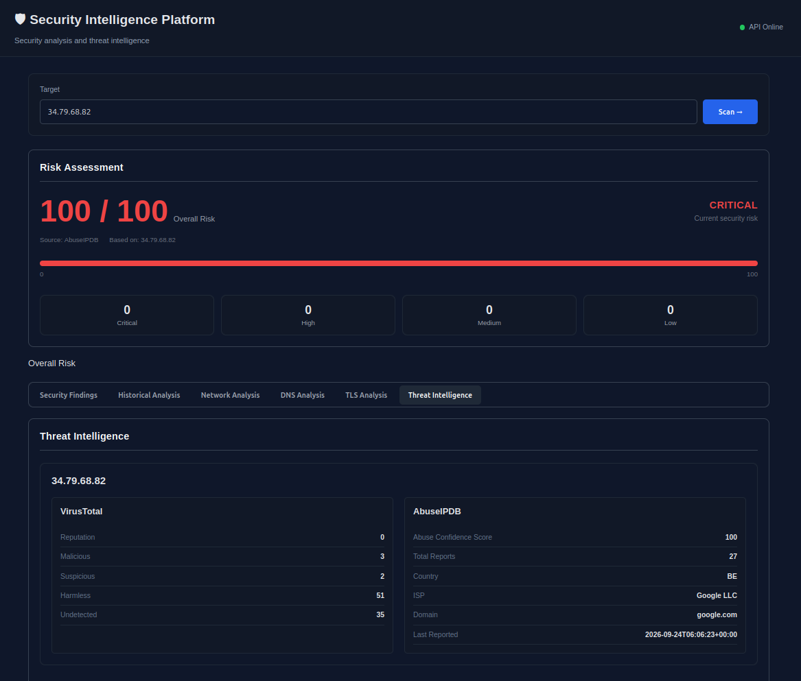
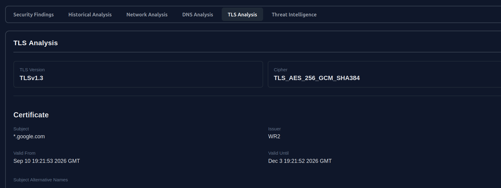
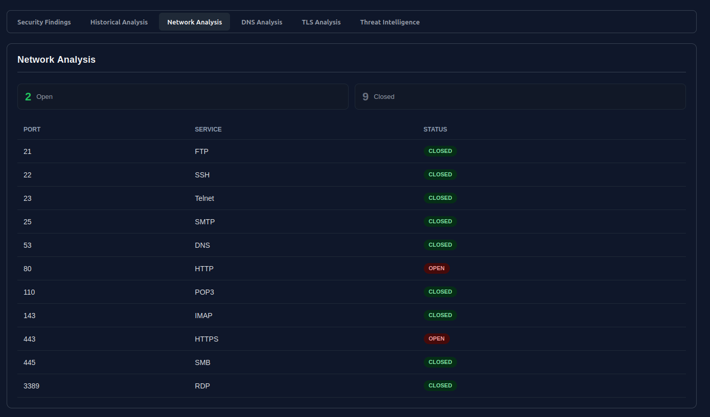
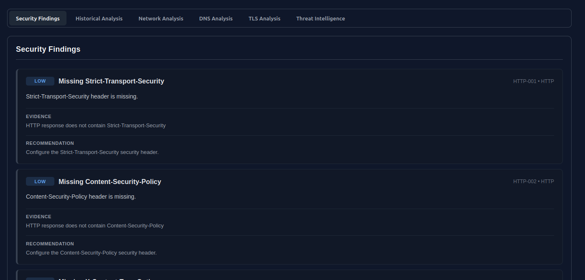
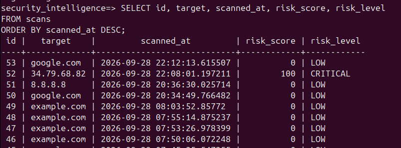
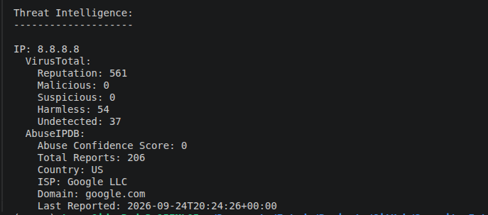

# Security Intelligence & Detection Platform

A cybersecurity platform designed to analyze **IP addresses and domains**, perform security checks, identify security findings, assess external threat intelligence, track changes over time, and present the results through a web dashboard.

The main goal of this project is to build a security analysis and detection engine rather than simply displaying information retrieved from existing security platforms.

The platform performs its own **DNS, HTTP/HTTPS, TLS and network analysis**, applies custom detection rules, integrates external threat intelligence, calculates an AbuseIPDB-based risk score, stores historical scan results, and compares changes between scans.

---

## 1. Project Goals

The platform allows a security analyst to submit an:

* IP address
* Domain name

The system currently supports:

1. Target classification and resolution.
2. DNS analysis.
3. HTTP/HTTPS analysis.
4. TLS version, cipher and certificate analysis.
5. Controlled TCP port analysis.
6. Custom security detection rules.
7. Structured security findings with evidence and recommendations.
8. External threat intelligence enrichment through VirusTotal and AbuseIPDB.
9. AbuseIPDB-based risk assessment.
10. Historical scan storage and comparison.
11. Web-based visualization of analysis results.

The current architecture focuses on the complete analysis pipeline:

```text
Target
   │
   ▼
Analysis Engine
   │
   ├── DNS
   ├── HTTP/HTTPS
   ├── TLS
   └── Network
   │
   ├──────────────────────┐
   ▼                      ▼
Detection Engine    Threat Intelligence
   │                 ├── VirusTotal
   ▼                 └── AbuseIPDB
Findings                   │
                           ▼
                     Risk Assessment
                           │
             ┌─────────────┴─────────────┐
             ▼                           ▼
       PostgreSQL              Historical Analysis
             │                           │
             └─────────────┬─────────────┘
                           ▼
                     Web Dashboard
```

The risk assessment is independent of the custom detection findings. The current risk score is based on the **highest AbuseIPDB Abuse Confidence Score among the resolved IPv4 addresses** for the target.

Future development may focus on expanding detection coverage, improving historical analysis, enriching the dashboard, adding additional security checks, and improving the deployment and testing workflow.

---

## Dashboard

The platform provides a web-based interface for submitting targets and visualizing the results of the security analysis.



---

## 2. Core Concept

The platform is designed around a clear separation between **technical analysis**, **security detection**, **threat intelligence**, and **risk assessment**.

```text
                           User
                             │
                             ▼
                           Target
                      (IP / Domain)
                             │
                             ▼
                  ┌────────────────────┐
                  │   Analysis Engine  │
                  ├────────────────────┤
                  │ DNS                │
                  │ HTTP/HTTPS         │
                  │ TLS                │
                  │ Network            │
                  └─────────┬──────────┘
                            │
                    ┌───────┴────────┐
                    │                │
                    ▼                ▼
            Detection Engine   Threat Intelligence
                    │          ├── VirusTotal
                    ▼          └── AbuseIPDB
                Findings              │
                                      ▼
                              Risk Assessment
                                      │
                    ┌─────────────────┴──────────────┐
                    ▼                                ▼
               PostgreSQL                    Historical Analysis
                    │                                │
                    └────────────────┬───────────────┘
                                     ▼
                              Web Dashboard
```

The **Analysis Engine** collects technical information from the target through DNS, HTTP/HTTPS, TLS and controlled network analysis.

The **Detection Engine** interprets that information using custom security rules and generates structured findings containing severity, evidence and recommendations.

The **Threat Intelligence** layer enriches the analysis using external reputation sources. VirusTotal provides additional contextual information, while the AbuseIPDB Abuse Confidence Score is used as the source for the platform's overall risk score.

The **Risk Assessment** is intentionally independent from the Detection Engine findings. Detection findings provide detailed security observations, while the overall risk score is derived from the **highest available AbuseIPDB score among the target's resolved IPv4 addresses**.

The results are persisted in **PostgreSQL**, allowing the platform to compare the current analysis with previous scans and identify changes over time, including changes to risk, exposed ports and resolved IP addresses.

The **Web Dashboard** provides the interface through which analysts can submit targets and visualize the resulting security analysis.

---

## 3. DNS Analysis

The platform performs DNS queries to collect relevant DNS information for domain targets.

The current implementation supports:

* A records (IPv4)
* AAAA records (IPv6)
* MX records
* NS records
* TXT records
* CNAME records

For domain targets, the scanner performs IPv4 and IPv6 resolution and queries the supported DNS record types.

Example:

```text
example.com

A
→ 93.184.216.34

MX
→ mail.example.com

NS
→ ns1.example.com
→ ns2.example.com
```

The collected DNS information is stored as part of the scan results and is used by the Threat Intelligence and Historical Analysis components.

The Threat Intelligence layer uses the resolved IPv4 addresses for external reputation analysis through VirusTotal and AbuseIPDB.

Historical Analysis can identify changes in the target's resolved IPv4 and IPv6 addresses between scans.

DNS-specific detection rules are not currently implemented. Future versions may introduce detections for unexpected DNS changes, suspicious configurations, or other DNS-related security indicators.

---

## 4. HTTP / HTTPS Analysis

The platform performs HTTP and HTTPS analysis against the submitted target when applicable.

The scanner collects:

* HTTP status code
* Requested/response URL
* HTTP response headers
* Security-related headers
* Redirect information

Redirects are intentionally **not automatically followed** during the initial request. This allows the scanner to inspect the returned HTTP status code and `Location` header directly.

Example:

```text id="9h3r2f"
HTTP Status: 301

Location:
→ https://example.com/

Security Headers:

HSTS:        Present
CSP:         Present
X-Frame:     Present
X-Content:   Missing
```

The scanner currently checks the presence and value of the following security headers:

* `Strict-Transport-Security`
* `Content-Security-Policy`
* `X-Frame-Options`
* `X-Content-Type-Options`
* `Referrer-Policy`
* `Permissions-Policy`

The collected HTTP/HTTPS information is stored as part of the scan results.

### Detection Coverage

The Detection Engine currently evaluates the following HTTP security characteristics:

* Missing security headers

Each detected condition is represented as a structured finding containing severity, evidence and a remediation recommendation.

Example:

```text
[LOW] Missing Strict-Transport-Security
```

---

## 5. TLS Analysis

For HTTPS-enabled targets, the platform analyzes the TLS connection and associated certificate information.

The scanner collects:

* TLS version
* Cipher
* Certificate subject
* Certificate issuer
* Certificate validity period
* Subject Alternative Names (SANs)

Example:

```text id="9s4k1e"
TLS Analysis

Protocol: TLSv1.3

Cipher:
→ TLS_AES_256_GCM_SHA384

Certificate:

Subject:
→ www.example.com

Issuer:
→ Example CA

Valid From:
→ 2026-01-01

Valid Until:
→ 2027-01-01

SANs:

→ www.example.com
→ example.com
```

The collected TLS information is stored as part of the scan results and is evaluated by the Detection Engine.

### Detection Coverage

The Detection Engine currently evaluates TLS and certificate-related security conditions.

Examples of findings include:

```text id="h4w7pz"
[HIGH] Deprecated TLS version detected

[LOW] Invalid certificate
```

Additional TLS and certificate validation rules may be introduced in future versions.

The TLS analysis is implemented as part of the platform's own analysis engine rather than relying solely on an external security scanning service.

### Example

The dashboard presents the TLS connection and certificate information collected during the scan.



---

# 6. Network / Port Analysis

The scanner performs controlled TCP connectivity checks against a predefined set of common ports.

The current implementation checks:

```text
21     FTP
22     SSH
23     Telnet
25     SMTP
53     DNS
80     HTTP
110    POP3
143    IMAP
443    HTTPS
445    SMB
3389   RDP
```

The scanner identifies the TCP connectivity state for each port:

```text
OPEN
CLOSED
FILTERED
```

Example:

```text
Port Analysis

22     OPEN
80     OPEN
443    OPEN
3389   CLOSED
```

A port is considered **open** when a TCP connection can be established. A **closed** port indicates that the connection was refused or could not be established within the expected conditions. A **filtered** state is returned when the connection attempt fails due to other network-level errors.

The current implementation uses TCP connection attempts rather than a raw SYN scan.

The port analysis is intentionally limited to a predefined set of common services rather than performing a full port scan.

The project is designed for controlled security analysis and should only be used against systems for which the user has authorization.

### Detection Coverage

The Detection Engine evaluates selected exposed services and can generate security findings when a service is considered security-relevant.

Current examples include:

```text
[MEDIUM] FTP exposed

[HIGH] Telnet exposed

[MEDIUM] SMB exposed

[MEDIUM] RDP exposed
```

Not every open port automatically generates a security finding. The Detection Engine applies specific rules to determine which exposed services should be reported.

Additional service-specific detection rules may be introduced in future versions.

### Example

The dashboard presents the TCP port analysis results, showing the ports identified as **open, closed or filtered** during the scan.




---

## 7. Current Scan Data Structure

The Analysis Engine combines the results from the different analysis modules into a structured scan result:

```python
scan_results = {
    "target": name,
    "dns": dns_results,
    "http": http_results,
    "tls": tls_results,
    "ports": port_results
}
```

This structure provides the technical data used by the Detection Engine, Threat Intelligence layer, and Historical Analysis.

During the analysis pipeline, the scan results are enriched with external threat intelligence data:

```python
scan_results["threat_intelligence"] = threat_intelligence
```

The separation between the different layers is intentional:

```text
                    Analysis Engine
                          │
                          │ Collect technical data
                          ▼
                     scan_results
                          │
              ┌───────────┴───────────┐
              │                       │
              ▼                       ▼
      Detection Engine       Threat Intelligence
              │                       │
              ▼                       ▼
          Findings              External Data
                                      │
                                      ▼
                               Risk Assessment
```

The Analysis Engine is responsible for collecting technical information.

The Detection Engine interprets that information according to predefined security rules and generates structured findings.

The Threat Intelligence layer enriches the analysis using external reputation data from VirusTotal and AbuseIPDB.

The Risk Assessment uses the available AbuseIPDB data to calculate the overall risk score independently of the Detection Engine findings.

This separation allows the platform to distinguish between:

* **Collected technical data**
* **Security findings generated by detection rules**
* **External threat intelligence**
* **Overall risk assessment**

---

## 8. Detection Engine

The Detection Engine consumes the structured `scan_results` generated by the Analysis Engine and applies custom security detection rules.

The engine currently evaluates:

* Deprecated TLS versions
* Certificate validity
* Missing security headers
* Exposed services

The Detection Engine converts raw scanner data into structured security findings.

Each finding contains information such as:

* Rule ID
* Finding title
* Severity
* Description
* Evidence
* Protocol
* Recommendation

Example:

```text id="j8f4p2"
Rule ID: TLS-001

Finding: Deprecated TLS Version

Severity: HIGH

Evidence: TLSv1.0

Recommendation:
Disable deprecated TLS versions and use modern TLS configurations.
```

The Detection Engine is designed to separate **data collection** from **security interpretation**.

The Analysis Engine collects technical information, while the Detection Engine determines whether that information represents a security finding according to the project's detection rules.

### Findings and Risk Assessment

Detection findings are intentionally kept independent from the overall Risk Score.

The severity assigned to a finding does **not** directly contribute points to the Risk Score.

Instead:

```text id="q6k3mr"
Scanner
   │
   ▼
scan_results
   │
   ├───────────────► Detection Engine
   │                       │
   │                       ▼
   │                   Findings
   │
   └───────────────► Threat Intelligence
                           │
                           ▼
                     Risk Assessment
```

The current Risk Assessment is based on the **highest available AbuseIPDB Abuse Confidence Score** among the target's resolved IPv4 addresses.

This separation allows the platform to provide two distinct perspectives:

* **Detailed security findings** generated by custom detection rules
* **External reputation-based risk assessment** based on threat intelligence

## The two outputs complement each other without one directly determining the other.


### Example Findings

The Detection Engine generates structured security findings based on the technical analysis performed by the platform.



---

## 9. Risk Assessment

The Risk Assessment module calculates the overall risk score independently from the findings generated by the Detection Engine.

The risk score is based on the **AbuseIPDB Abuse Confidence Score** associated with the target's resolved IPv4 addresses.

For targets resolving to multiple IPv4 addresses, the highest available AbuseIPDB score is used as the overall risk score.

```text
Target
   ↓
DNS Resolution
   ↓
IPv4 Addresses
   ↓
AbuseIPDB
   ↓
Abuse Confidence Scores
   ↓
Highest Available Score
   ↓
Risk Assessment
```

The project currently maps the AbuseIPDB score to four risk levels:

```text
75–100    CRITICAL
50–74     HIGH
25–49     MODERATE
0–24      LOW
```

These risk levels are **project-defined categorizations** used to present the numerical AbuseIPDB score in the dashboard. They are not official AbuseIPDB risk classifications.

### Risk Score and Detection Findings

The Detection Engine and Risk Assessment are intentionally independent.

Detection findings provide detailed security observations, evidence, severity and recommendations, but their severity does **not** contribute to the overall risk score.

For example, a target may have several `LOW` or `HIGH` findings while still having a low AbuseIPDB score. Conversely, a target with no local detection findings may still receive a high risk score if its IP address has a high AbuseIPDB Abuse Confidence Score.

This separation allows the platform to distinguish between:

* **Risk Assessment** — external threat intelligence reputation
* **Detection Findings** — locally identified security observations

### Multiple IP Addresses

When a domain resolves to multiple IPv4 addresses, AbuseIPDB is queried for each address.

Example:

```text
example.com

    ↓

192.0.2.10 → Abuse Confidence: 5
192.0.2.20 → Abuse Confidence: 72
192.0.2.30 → Abuse Confidence: 18
```

The resulting risk assessment is:

```text
Risk Score: 72 / 100
Risk Level: HIGH
Based on: 192.0.2.20
Source: AbuseIPDB
```

The highest available score is used as the target's overall AbuseIPDB-based risk score.

### Unavailable Risk Data

If no usable AbuseIPDB score is available, the platform does not treat the absence of threat intelligence data as a zero-risk result.

The Risk Assessment returns no numerical score and the dashboard displays:

```text
Risk Score: N/A
Risk Level: UNKNOWN
Source: Not available
```

This distinction is important:

```text
0 / 100  → AbuseIPDB provided a score of 0

N/A      → No usable AbuseIPDB score is available
```

### VirusTotal

VirusTotal is used as an additional threat intelligence source and enrichment layer.

Its results are displayed as contextual information but **do not currently contribute to the Risk Score**.

This keeps the risk calculation deterministic and based on a single defined source while still providing additional threat intelligence context.

### Example Output

```text
Risk Assessment

Risk Score: 100 / 100
Risk Level: CRITICAL
Source: AbuseIPDB
Based on: 34.79.68.82
```

The dashboard also displays the severity distribution of Detection Engine findings separately. These findings are informational and are not used to calculate the AbuseIPDB-based risk score.

---

## 10. Historical Analysis

The Historical Analysis module allows the platform to monitor how the security posture of a target changes over time.

Each completed scan is persisted in PostgreSQL, allowing the platform to retrieve the most recent previous scan for a target and compare it against the current analysis.

The current historical analysis compares:

* Risk score
* Risk level
* Open and closed TCP ports
* IPv4 address changes
* IPv6 address changes

Current architecture:

```text id="b1w8dr"
                    Current Scan
                         │
                         ▼
                 ┌───────────────┐
                 │    Scanner    │
                 └───────┬───────┘
                         │
                         ▼
                  Scan Results
                         │
             ┌───────────┴───────────┐
             ▼                       ▼
      Detection Engine        Threat Intelligence
             │                       │
             ▼                       ▼
          Findings             AbuseIPDB / VT
                                     │
                                     ▼
                              Risk Assessment
                                     │
             └───────────┬───────────┘
                         │
                         ▼
                Historical Analysis
                         │
                         ▼
                  Change Detection
                         │
                         ▼
                    PostgreSQL
```

For each target, the platform retrieves the most recent previous scan and compares it with the current scan.

The Risk Score used in the historical comparison is the AbuseIPDB-based score generated during each scan.

Example:

```text id="j79f5p"
Previous Scan

  Risk Score: 20
  Risk Level: LOW

  Port 443: OPEN
  Port 3389: CLOSED

  IPv4:
    93.184.216.34


Current Scan

  Risk Score: 45
  Risk Level: MODERATE

  Port 443: OPEN
  Port 3389: OPEN

  IPv4:
    1.2.3.4
```

The platform can identify changes such as:

```text id="4a7p8n"
Risk Score: 20 → 45

Risk Level: LOW → MODERATE

Ports Opened:
  [NEW] Port 3389 is now open.

IPv4 Addresses Added:
  [ADDED] 1.2.3.4

IPv4 Addresses Removed:
  [REMOVED] 93.184.216.34
```

If no relevant changes are detected, the platform reports:

```text id="3c8k1v"
Historical Analysis
-------------------
No changes detected.
```

If no previous scan exists for the target, the platform reports that no historical comparison is available.

The historical analysis is designed to evolve as additional analysis modules are introduced.

Future comparison capabilities may include:

* TLS configuration changes
* Certificate changes
* Security header changes
* New security findings
* Resolved security findings
* DNS record changes beyond IP addresses
* Changes in threat intelligence results

This allows the platform to evolve from a point-in-time security scanner into a system capable of tracking changes in a target's security posture over time.

---

## 11. Database & Configuration

The platform uses **PostgreSQL** to persist completed scans and support historical security posture analysis.

### Database

The current database configuration uses:

```text
Database: security_intelligence
Table: scans
```

The `scans` table stores:

* Target
* Scan timestamp
* Risk score
* Risk level
* Complete scan results in JSONB format

The current schema is:

```text
id
target
scanned_at
risk_score
risk_level
scan_results
```

The application communicates with PostgreSQL through the `psycopg` driver.

### Stored Scan Data

Completed scans are persisted in PostgreSQL, allowing the platform to retrieve previous results and perform historical comparisons.



### Configuration and Secrets

Database credentials and external API keys are provided through environment variables rather than being hardcoded in the source code.

Example:

```text
DATABASE_HOST=localhost
DATABASE_NAME=security_intelligence
DATABASE_USER=security_platform
DATABASE_PASSWORD=your_password

VIRUSTOTAL_API_KEY=your_api_key
ABUSEIPDB_API_KEY=your_api_key
```

During local development, these values can be stored in a `.env` file:

```text
.env
```

The `.env` file is excluded from version control through `.gitignore`, preventing local credentials and API keys from being committed to the repository.

### Risk Score Nullability

The `risk_score` field allows `NULL` values.

This is intentional because a Risk Score is only generated when a usable AbuseIPDB score is available.

When no usable AbuseIPDB score exists, the platform stores:

```text
risk_score: NULL
risk_level: UNKNOWN
```

This prevents missing threat intelligence data from being incorrectly represented as a zero-risk result.

The distinction is therefore:

```text
0 / 100 → AbuseIPDB returned a score of 0
N/A      → No usable AbuseIPDB score was available
```

---

## 12. Threat Intelligence

The Threat Intelligence layer enriches the results generated by the internal analysis engine with external reputation and intelligence data.

The current implementation integrates:

* **VirusTotal**
* **AbuseIPDB**

For domain targets, the platform resolves the target to IPv4 addresses and uses the resolved addresses for threat intelligence lookups.

For IP targets, the target IP is directly used for threat intelligence lookups.

The Threat Intelligence layer currently collects information such as:

### VirusTotal

* Reputation score
* Malicious detections
* Suspicious detections
* Harmless detections
* Undetected results

### AbuseIPDB

* Abuse Confidence Score
* Total reports
* Country
* ISP
* Associated domain
* Last reported date

API keys are provided through environment variables and are not stored directly in the source code or repository.

The Threat Intelligence layer is designed as an **optional enrichment layer**. If an external API is unavailable, rate-limited, not configured, or returns an error, the internal security analysis can continue without depending on the external service.

HTTP `429 Too Many Requests` responses are explicitly handled to prevent external API rate limits from interrupting the overall scan.

### Threat Intelligence and Risk Assessment

AbuseIPDB has a specific role in the platform's Risk Assessment.

The **Abuse Confidence Score** is used as the source for the overall risk score. When a target resolves to multiple IPv4 addresses, the **highest available AbuseIPDB score** is selected.

```text
Target
   │
   ├── Internal Analysis
   │      ├── DNS
   │      ├── HTTP/HTTPS
   │      ├── TLS
   │      └── Ports
   │
   ├── Detection Engine
   │      └── Findings
   │
   └── Threat Intelligence
          ├── VirusTotal
          │      └── Enrichment
          │
          └── AbuseIPDB
                 ├── Enrichment
                 └── Risk Score Source
```

VirusTotal remains an **informational enrichment source** and does not currently contribute to the Risk Score.

The Detection Engine findings are also independent from the Risk Assessment. Finding severity does not directly modify the AbuseIPDB-based score.

If no usable AbuseIPDB score is available, the platform returns an `UNKNOWN` risk level rather than treating the absence of threat intelligence data as a zero-risk result.

The Threat Intelligence results are presented in the web dashboard alongside the internal security analysis.

The following example shows the Threat Intelligence output generated when analyzing `8.8.8.8`:



---

## 13. Web Dashboard

The platform includes a web-based dashboard for submitting targets and visualizing the results generated by the analysis engine.

The dashboard is served directly by the **FastAPI** application and provides a centralized interface for security analysis.

Current functionality includes:

* Target submission for IP addresses and domains
* Scan execution through the API
* Risk Assessment
* Risk score and risk level visualization
* Detection findings
* Finding severity breakdown
* DNS information
* HTTP/HTTPS information
* TLS information
* Network and port analysis
* Threat intelligence results
* Historical scan comparisons
* Responsive layout for smaller screens

The dashboard separates the main analysis areas into dedicated sections, making the results easier to interpret than raw API responses.

The current interface is organized around the following analysis areas:

```text id="n7h4kc"
Target
   │
   ↓
Security Analysis
   │
   ├── Risk Assessment
   ├── Findings
   ├── Historical Analysis
   ├── Network Analysis
   ├── DNS Analysis
   ├── TLS Analysis
   └── Threat Intelligence
```

HTTP/HTTPS analysis is presented as part of the overall scan results and contributes to the security findings displayed by the dashboard.

The frontend is intentionally lightweight and is implemented using **HTML, CSS and JavaScript**, with the FastAPI application responsible for serving the dashboard and exposing the analysis API.

The dashboard also provides visual distinctions between risk levels and finding severities, allowing analysts to quickly identify the overall AbuseIPDB-based risk assessment while keeping individual security findings separate from the risk score.

Further UI improvements, additional visualizations and more detailed presentation of historical data are planned as part of the project's future development.

---

## 14. Final Technology Stack

| Area                | Technology                  |
| ------------------- | --------------------------- |
| Backend             | Python                      |
| API Framework       | FastAPI                     |
| Frontend            | HTML / CSS / JavaScript     |
| Database            | PostgreSQL                  |
| Network Analysis    | Python                      |
| DNS Analysis        | Python                      |
| HTTP Analysis       | Python                      |
| TLS Analysis        | Python                      |
| Threat Intelligence | VirusTotal / AbuseIPDB APIs |
| Operating System    | Linux                       |
| Version Control     | Git / GitHub                |

The platform is intentionally built using lightweight technologies, with Python serving as the core language for the security analysis, detection logic, API and database integration.

---

## 15. Project Scope

The current platform implements an end-to-end security analysis workflow:

```text id="5p8q1m"
                    TARGET
                       │
                       ▼
              ┌────────────────┐
              │   Scan Engine  │
              └───────┬────────┘
                      │
       ┌──────────────┼──────────────┐
       ▼              ▼              ▼
      DNS          HTTP/TLS       NETWORK
       │              │              │
       └──────────────┼──────────────┘
                      │
                      ▼
             Detection Engine
                      │
                      ▼
                  Findings
                      │
                      │
                      ├─────────────────────┐
                      │                     │
                      ▼                     ▼
             Threat Intelligence     Historical Data
              ├── VirusTotal
              └── AbuseIPDB
                      │
                      ▼
               Risk Assessment
                      │
                      ▼
                Web Dashboard
```

The platform demonstrates practical experience across:

* Cybersecurity analysis and detection
* Network and protocol analysis
* DNS, HTTP/HTTPS and TLS
* Threat intelligence integration
* Risk assessment
* Python development
* REST API development
* PostgreSQL and JSONB data storage
* Web frontend development
* Linux
* Git and GitHub

The core focus is on building a security analysis and detection engine rather than simply consuming external security APIs.

### Future Development

Potential future improvements include:

* Expanded detection coverage
* More detailed historical comparisons
* Additional threat intelligence sources
* Improved dashboard visualizations
* Automated testing and CI/CD
* Containerized deployment
* Additional security analysis capabilities