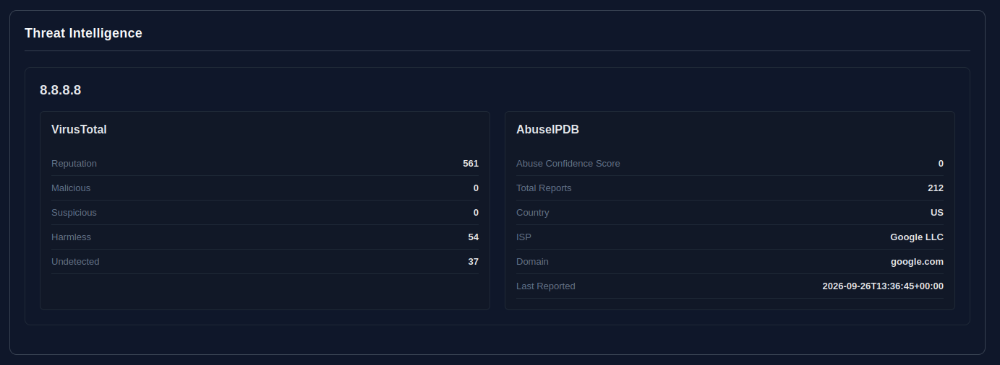

# Security Intelligence & Detection Platform

A cybersecurity platform designed to analyze **IP addresses and domains**, perform security checks, identify security findings, assess external threat intelligence, track changes over time, and present the results through a web dashboard.

The main goal of this project is to build a security analysis and detection engine rather than simply displaying information retrieved from existing platforms.

The platform performs its own **DNS, HTTP/HTTPS, TLS and network analysis**, applies custom detection rules, integrates external threat intelligence, calculates an AbuseIPDB-based risk score, stores historical scan results, and compares changes between scans.

---

## 1. Project Goals

The platform allows a security analyst to submit an:

* IP address
* Domain name

The system currently supports:

1. Target identification and resolution.
2. DNS analysis.
3. HTTP/HTTPS analysis.
4. TLS certificate and configuration analysis.
5. Controlled TCP port analysis.
6. Custom security detection rules.
7. Structured security findings with evidence and recommendations.
8. External threat intelligence enrichment through VirusTotal and AbuseIPDB.
9. AbuseIPDB-based risk assessment.
10. Historical scan storage and comparison.
11. Web-based visualization of analysis results.

The project is being developed incrementally, with the current architecture focusing on the complete analysis pipeline:

```text
Target
   │
   ▼
Analysis Engine
   │
   ├── DNS
   ├── HTTP/HTTPS
   ├── TLS
   └── Network
   │
   ├──────────────────────┐
   ▼                      ▼
Detection Engine    Threat Intelligence
   │                 ├── VirusTotal
   ▼                 └── AbuseIPDB
Findings                   │
                           ▼
                     Risk Assessment
                           │
             ┌─────────────┴─────────────┐
             ▼                           ▼
       PostgreSQL              Historical Analysis
             │                           │
             └─────────────┬─────────────┘
                           ▼
                     Web Dashboard
```

Future development will focus on expanding detection coverage, improving historical analysis, enriching the dashboard, adding additional security checks, and strengthening the deployment and testing workflow.

---

## 2. Core Concept

The platform is designed around a clear separation between **technical analysis**, **security detection**, **threat intelligence**, and **risk assessment**.

```text
                           User
                             │
                             ▼
                           Target
                      (IP / Domain)
                             │
                             ▼
                  ┌────────────────────┐
                  │   Analysis Engine  │
                  ├────────────────────┤
                  │ DNS                │
                  │ HTTP/HTTPS         │
                  │ TLS                │
                  │ Network            │
                  └─────────┬──────────┘
                            │
                    ┌───────┴────────┐
                    │                │
                    ▼                ▼
            Detection Engine   Threat Intelligence
                    │          ├── VirusTotal
                    ▼          └── AbuseIPDB
                Findings              │
                                      ▼
                              Risk Assessment
                                      │
                    ┌─────────────────┴──────────────┐
                    ▼                                ▼
               PostgreSQL                    Historical Analysis
                    │                                │
                    └────────────────┬───────────────┘
                                     ▼
                              Web Dashboard
```

The **Analysis Engine** collects technical information directly from the target.

The **Detection Engine** interprets that information using custom security rules and generates structured findings containing severity, evidence and recommendations.

The **Threat Intelligence** layer enriches the analysis using external reputation sources. VirusTotal provides additional contextual information, while the AbuseIPDB Abuse Confidence Score is used as the source for the platform's overall risk score.

The **Risk Assessment** is intentionally independent from the Detection Engine findings. Detection findings provide detailed security observations, while the overall risk score is derived from the highest available AbuseIPDB score among the target's resolved IPv4 addresses.

The results are persisted in **PostgreSQL**, allowing the platform to compare the current analysis with previous scans and identify changes over time.

The **Web Dashboard** provides the interface through which analysts can submit targets and visualize the resulting security analysis.

---

# 3. Target Validation

The platform accepts:

```text
IP address
Domain
```

The system determines whether the submitted target is an IP address or a domain name before starting the analysis.

Examples:

```text
8.8.8.8
example.com
subdomain.example.com
```

Invalid or malformed targets will be rejected.

---

# 4. DNS Analysis

The platform currently performs DNS queries and collects relevant DNS information.

The implementation supports:

* A records
* AAAA records
* MX records
* NS records
* TXT records
* CNAME records
* Reverse DNS / PTR records

For domain targets, the scanner performs IPv4 and IPv6 resolution and queries the supported DNS record types.

Example:

```text
example.com

A
→ 93.184.216.34

MX
→ mail.example.com

NS
→ ns1.example.com
→ ns2.example.com
```

For IP targets, the scanner performs reverse DNS / PTR resolution.

The collected DNS information is stored in the scan results structure and is used by the Detection Engine, Threat Intelligence layer and Historical Analysis.

### Detection Coverage

The Detection Engine currently focuses on security-relevant findings derived from the collected scan data.

Additional DNS-specific detection rules may be introduced in future versions, such as:

- Unexpected DNS record changes
- Suspicious DNS configuration
- Domains resolving to unexpected infrastructure
- Suspicious or unusual DNS characteristics

Detection rules are implemented by the project rather than simply copied from an external service.

---

# 5. HTTP / HTTPS Analysis

The platform currently performs HTTP and HTTPS analysis against the submitted target when applicable.

The scanner collects:

* HTTP status code
* Final/requested URL
* Redirect information
* HTTP Response headers
* Security-related headers
* HTTPS availability

Redirects are intentionally not automatically followed during the initial request, allowing the scanner to identify the returned Location header.

Examples:

```text
HTTP Status: 301
HTTPS: Available
Redirect: HTTP → HTTPS

Security Headers:

HSTS:        Present
CSP:         Present
X-Frame:     Present
X-Content:   Missing

The scanner currently checks the presence and value of:

Strict-Transport-Security
Content-Security-Policy
X-Frame-Options
X-Content-Type-Options
Referrer-Policy

The collected HTTP information is stored in the scan results structure.
```

### Detection Coverage

The Detection Engine currently evaluates HTTP/HTTPS security characteristics such as:

- Missing security headers
- HTTPS configuration
- Other HTTP security-related conditions

Example findings:

[LOW] Missing security header

---

# 6. TLS Analysis

For HTTPS-enabled targets, the platform analyzes the TLS configuration and associated certificate information.

The scanner collects:

* TLS version
* Cipher
* Certificate subject
* Certificate issuer
* Certificate validity period
* Certificate expiration date
* Subject Alternative Names (SANs)

Example:

```text
TLS Analysis

Protocol: TLSv1.3

Cipher: TLS_AES_256_GCM_SHA384

Certificate:

Subject: www.example.com
Issuer: Example CA
Valid From: 2026-01-01
Valid Until: 2027-01-01

SANs:
→ www.example.com
→ example.com
```

The collected TLS information is stored in the scan results structure and is evaluated by the Detection Engine.

### Detection Coverage

The Detection Engine currently evaluates TLS and certificate-related security conditions.

Examples of findings include:

```text
[HIGH] Deprecated TLS version detected
[LOW] Invalid certificate
```

Additional TLS and certificate validation rules may be introduced in future versions.

The TLS analysis is implemented as part of the platform's own analysis engine rather than relying solely on an external security scanning service.

---

# 7. Network / Port Analysis

The scanner performs controlled TCP connectivity checks against a predefined set of common ports.

The current implementation checks:

```text
21     FTP
22     SSH
23     Telnet
25     SMTP
53     DNS
80     HTTP
110    POP3
143    IMAP
443    HTTPS
445    SMB
3389   RDP
```

The scanner identifies whether a TCP connection can be established:

```text
OPEN
CLOSED
```

Example:

```text
Port Scan

22     OPEN
80     OPEN
443    OPEN
3389   CLOSED
```

The current implementation uses TCP connection attempts rather than a raw SYN scan.

The port analysis is intentionally limited to a predefined set of common services rather than performing a full port scan.

The project is designed for controlled security analysis and should only be used against systems for which the user has authorization.

### Detection Coverage

The Detection Engine evaluates selected exposed services and can generate security findings when a service is considered security-relevant.

Current examples include:

```text
[MEDIUM] RDP exposed
[HIGH] Telnet exposed
[MEDIUM] SMB exposed
```

Not every open port automatically generates a security finding. The Detection Engine applies specific rules to determine which exposed services should be reported.

Additional service-specific detection rules may be introduced in future versions.


--- 

# 8. Current Scan Data Structure

The scanner combines the results from the different analysis modules into a single structured object:

```python id="7iyf9r"
scan_results = {
    "target": name,
    "dns": dns_results,
    "http": http_results,
    "tls": tls_results,
    "ports": port_results

}
```

This structure provides the interface between the Analysis Engine and the Detection Engine, while also providing the data required by the Threat Intelligence layer.

The separation is intentional:

```text id="d2n7v6"
                    Analysis Engine

                          │
                          │ Collect facts
                          ▼
                     scan_results
                          │
              ┌───────────┴───────────┐
              │                       │
              ▼                       ▼
      Detection Engine       Threat Intelligence
              │                       │
              ▼                       ▼
          Findings              External Data
                                      │
                                      ▼
                               Risk Assessment
```

The scanner is responsible for collecting technical information, while the Detection Engine is responsible for interpreting that information according to security rules.

The Threat Intelligence layer independently enriches the scan results with external reputation data, which is used by the Risk Assessment module.

This separation allows the platform to distinguish between:

* **Collected technical data**
* **Security findings generated by detection rules**
* **External threat intelligence**
* **Overall risk assessment**

--- 

# 9. Detection Engine

Status: Implemented

The Detection Engine consumes the structured `scan_results` generated by the scanner and applies custom security detection rules.

The engine currently evaluates areas such as:

* TLS version
* Security headers
* Exposed services
* Certificate configuration
* HTTP/HTTPS security configuration

The Detection Engine converts raw scanner data into structured findings.

Each finding contains information such as:

* Rule ID
* Finding title
* Severity
* Description
* Evidence
* Protocol
* Recommendation

Example:

```text id="4o7v6s"
Rule ID: TLS-001

Finding: Deprecated TLS Version

Severity: HIGH

Evidence: TLSv1.0

Recommendation:
Disable deprecated TLS versions and use modern TLS configurations.
```

The Detection Engine is designed to separate **data collection** from **security interpretation**.

The scanner collects technical information, while the Detection Engine determines whether that information represents a security finding.

### Findings and Risk Assessment

Detection findings are intentionally kept independent from the overall Risk Score.

The severity assigned to a finding does not directly contribute points to the Risk Score.

Instead:

```text id="rj7q0b"
Scanner
   │
   ▼
scan_results
   │
   ├───────────────► Detection Engine
   │                       │
   │                       ▼
   │                   Findings
   │
   └───────────────► Threat Intelligence
                           │
                           ▼
                     Risk Assessment
```

The current Risk Assessment is based on the **highest available AbuseIPDB Abuse Confidence Score** among the target's resolved IPv4 addresses.

This architecture allows the platform to provide both:

* **Detailed local security findings** generated by custom detection rules
* **An external reputation-based risk assessment** based on threat intelligence

---

# 10. Risk Assessment

Status: Implemented

The Risk Assessment module calculates the overall risk score independently from the findings generated by the Detection Engine.

The risk score is based on the **AbuseIPDB Abuse Confidence Score** associated with the target's resolved IPv4 addresses.

For targets resolving to multiple IPv4 addresses, the highest available AbuseIPDB score is used as the overall risk score.

```text
Target
   ↓
DNS Resolution
   ↓
IPv4 Addresses
   ↓
AbuseIPDB
   ↓
Abuse Confidence Scores
   ↓
Highest Score
   ↓
Risk Assessment
```

The project currently maps the AbuseIPDB score to four risk levels:

```text
75–100    CRITICAL

50–74     HIGH

25–49     MODERATE

0–24      LOW
```

These risk levels are **project-defined categorizations** used to present the numerical AbuseIPDB score in the dashboard. They are not official AbuseIPDB risk classifications.

### Risk Score and Detection Findings

The Detection Engine and Risk Assessment are intentionally independent.

Detection findings provide detailed security observations, evidence, severity and recommendations, but their severity does **not** contribute to the overall risk score.

For example, a target may have several `LOW` or `HIGH` findings while still having a low AbuseIPDB score. Conversely, a target with no local detection findings may still receive a high risk score if its IP address has a high AbuseIPDB Abuse Confidence Score.

This separation allows the platform to distinguish between:

* **Risk Assessment** — external threat intelligence reputation
* **Detection Findings** — locally identified security observations

### Multiple IP Addresses

When a domain resolves to multiple IPv4 addresses, AbuseIPDB is queried for each address.

Example:

```text
example.com
    ↓
192.0.2.10 → Abuse Confidence: 5
192.0.2.20 → Abuse Confidence: 72
192.0.2.30 → Abuse Confidence: 18
```

The resulting risk assessment is:

```text
Risk Score: 72/100
Risk Level: HIGH
Based on: 192.0.2.20
Source: AbuseIPDB
```

The highest available score is used to avoid hiding a potentially significant reputation signal behind lower scores from other resolved addresses.

### Unavailable Risk Data

If no usable AbuseIPDB score is available, the platform does not assume that the target is safe.

Instead, the Risk Assessment is returned as:

```text
Risk Score: N/A
Risk Level: UNKNOWN
Source: Not available
```

This distinction is important because:

```text
0 / 100  → AbuseIPDB provided a score of 0

N/A      → No usable AbuseIPDB score is available
```

Therefore, missing threat intelligence data is not treated as a zero-risk result.

### VirusTotal

VirusTotal is used as an additional threat intelligence source and enrichment layer.

Its results are displayed as contextual information but **do not currently contribute to the Risk Score**.

This keeps the risk calculation deterministic and based on a single defined source while still providing additional threat intelligence context.

### Example Output

```text
Risk Assessment

Risk Score: 100 / 100
Risk Level: CRITICAL

Source: AbuseIPDB
Based on: 34.79.68.82
```

The dashboard also displays the severity distribution of the Detection Engine findings separately. These findings are informational and are not used to calculate the AbuseIPDB-based risk score.


# 11. Historical Analysis

Status: Implemented

The Historical Analysis module allows the platform to monitor how the security posture of a target changes over time.

Each completed scan is persisted in PostgreSQL, allowing the platform to retrieve the most recent scan for a target and compare it against the current analysis.

The current historical analysis compares:

* Risk score
* Risk level
* Open and closed TCP ports
* IPv4 address changes
* IPv6 address changes

Current architecture:

```text
                    Current Scan

                         │

                         ▼

                 ┌───────────────┐
                 │    Scanner    │
                 └───────┬───────┘
                         │
                         ▼
                  Scan Results
                         │
             ┌───────────┴───────────┐
             ▼                       ▼
      Detection Engine        Threat Intelligence
             │                       │
             ▼                       ▼
          Findings             AbuseIPDB / VT
                                     │
                                     ▼
                              Risk Assessment
                                     │
             └───────────┬───────────┘
                         │
                         ▼
                Historical Analysis
                         │
                         ▼
                  Change Detection
                         │
                         ▼
                    PostgreSQL
```

For each target, the platform retrieves the most recent previous scan and compares it with the current scan.

The Risk Score used in the historical comparison is the AbuseIPDB-based score generated during each scan.

Example:

```text
Previous Scan

  Risk Score: 20
  Risk Level: LOW

  Port 443: OPEN
  Port 8080: CLOSED

  IPv4:
    93.184.216.34


Current Scan

  Risk Score: 45
  Risk Level: MODERATE

  Port 443: OPEN
  Port 8080: OPEN

  IPv4:
    1.2.3.4
```

The platform can identify changes such as:

```text
Risk Score: 20 -> 45

Risk Level: LOW -> MODERATE

Ports Opened:

  [NEW] Port 8080 is now open.

IPv4 Addresses Added:

  [ADDED] 1.2.3.4

IPv4 Addresses Removed:

  [REMOVED] 93.184.216.34
```

If no relevant changes are detected, the platform reports:

```text
Historical Analysis:

--------------------

No changes detected.
```

If no previous scan exists for the target, the platform reports that no historical comparison is available.

The historical analysis is designed to evolve as additional analysis modules are introduced.

Future comparison capabilities may include:

* TLS configuration changes
* Certificate changes
* Security header changes
* New security findings
* Resolved security findings
* DNS record changes beyond IP addresses
* Changes in threat intelligence results

This transforms the platform from a point-in-time security scanner into a system capable of monitoring the security posture of a target over time.

# 12. Database & Configuration

Status: Implemented

The database integration allows completed scans to be persisted, retrieved and compared over time for historical security posture analysis.

The platform currently uses PostgreSQL.

Database:

```text
Database: security_intelligence

Table: scans
```

The `scans` table stores:

* Target
* Scan timestamp
* Risk score
* Risk level
* Complete scan results in JSONB format

The current database schema is:

```text
id
target
scanned_at
risk_score
risk_level
scan_results
```

Python communicates with PostgreSQL through the `psycopg` driver.

Database credentials and API keys are not hardcoded in the source code. They are provided through environment variables.

Example:

```text
DATABASE_HOST=localhost
DATABASE_NAME=security_intelligence
DATABASE_USER=security_platform
DATABASE_PASSWORD=your_password
VIRUSTOTAL_API_KEY=your_api_key
ABUSEIPDB_API_KEY=your_api_key
```

A local `.env` file can be used during development and should be excluded from version control:

```text
.env
```

The project loads database configuration and external API credentials from environment variables rather than storing secrets directly inside the source code.

### Risk Score Nullability

The `risk_score` field allows `NULL` values.

This is intentional because a Risk Score is not generated when no usable AbuseIPDB score is available.

In this situation, the platform stores:

```text
risk_score: NULL
risk_level: UNKNOWN
```

This prevents missing threat intelligence data from being incorrectly represented as a zero-risk result.

The `.env` file is excluded from the Git repository through `.gitignore`, preventing local credentials and API keys from being committed.

---

# 13. Threat Intelligence

**Status: Implemented**

The Threat Intelligence layer enriches the results generated by the internal analysis engine with external reputation and intelligence data.

The current implementation integrates:

* **VirusTotal**
* **AbuseIPDB**

For domain targets, the platform first resolves the target to IPv4 addresses. Each resolved IPv4 address can then be queried against the configured threat intelligence providers.

For IP targets, the target IP is directly used for threat intelligence lookups.

The Threat Intelligence layer currently collects information such as:

### VirusTotal

* Reputation score
* Malicious detections
* Suspicious detections
* Harmless detections
* Undetected results

### AbuseIPDB

* Abuse confidence score
* Total reports
* Country
* ISP
* Associated domain
* Last reported date

API keys are loaded from environment variables through the `.env` configuration and are not stored in the repository.

The Threat Intelligence layer is designed as an **optional enrichment layer**. If an API is unavailable, rate-limited, not configured, or returns an error, the main security analysis continues normally.

HTTP `429 Too Many Requests` responses are explicitly handled to prevent external API rate limits from interrupting the scan.

### Threat Intelligence and Risk Assessment

AbuseIPDB has a specific role in the platform's Risk Assessment.

The **Abuse Confidence Score** is used as the source for the overall risk score. When a target resolves to multiple IPv4 addresses, the highest available AbuseIPDB score is selected.

```text
Target
   │
   ├── Internal Analysis
   │      ├── DNS
   │      ├── HTTP/HTTPS
   │      ├── TLS
   │      └── Ports
   │
   ├── Detection Engine
   │      └── Findings
   │
   └── Threat Intelligence
          ├── VirusTotal
          │      └── Enrichment
          │
          └── AbuseIPDB
                 ├── Enrichment
                 └── Risk Score Source
```

VirusTotal remains an **informational enrichment source** and does not currently contribute to the Risk Score.

The Detection Engine findings are also independent from the Risk Assessment. Finding severity does not directly modify the AbuseIPDB-based score.

If no usable AbuseIPDB score is available, the platform returns an `UNKNOWN` risk level rather than treating the absence of threat intelligence data as a zero-risk result.

The Threat Intelligence results are presented in the web dashboard alongside the internal security analysis.

The following example shows the Threat Intelligence output generated when analyzing `8.8.8.8`:



--- 

# 14. Web Dashboard

**Status: Implemented**

The platform includes a web-based dashboard for submitting targets and visualizing the results generated by the analysis engine.

The dashboard is served directly by the FastAPI application and provides a centralized interface for security analysis.

Current functionality includes:

* Target submission for IP addresses and domains
* Scan execution through the API
* Risk Assessment
* Risk score and risk level visualization
* Detection findings
* Finding severity breakdown
* DNS information
* HTTP/HTTPS information
* TLS information
* Network and port analysis
* Threat intelligence results
* Historical scan comparisons
* Responsive layout for smaller screens

The dashboard separates the main analysis areas into dedicated sections, allowing the results to be presented in a more accessible format than raw API responses.

The current interface is designed around the following structure:

```text
Target
   │
   ↓
Security Analysis
   │
   ├── Risk Assessment
   ├── Findings
   ├── Network Analysis
   ├── DNS Analysis
   ├── HTTP/HTTPS Analysis
   ├── TLS Analysis
   ├── Threat Intelligence
   └── Historical Analysis
```

The dashboard is intentionally implemented using a lightweight frontend based on **HTML, CSS and JavaScript**, served through FastAPI.

Further UI improvements, additional visualizations and refined presentation of historical data are planned as part of the project's future development.

---

# 15. Containers and CI/CD

Status: Planned

The application will eventually be containerized using Docker and Docker Compose.

GitHub Actions will be used to implement CI/CD workflows such as:

Git Push
   ↓
GitHub Actions
   ↓
Tests
   ↓
Linting / Validation
   ↓
Build

---

# 16. Final Technology Stack

| Area                | Technology              |
| ------------------- | ----------------------- |
| Backend             | Python                  |
| API Framework       | FastAPI                 |
| Frontend            | HTML / CSS / JavaScript |
| Database            | PostgreSQL              |
| Network Analysis    | Python                  |
| DNS Analysis        | Python                  |
| HTTP Analysis       | Python                  |
| TLS Analysis        | Python                  |
| Threat Intelligence | External APIs           |
| Containers          | Docker / Docker Compose |
| Operating System    | Linux                   |
| Version Control     | Git / GitHub            |
| CI/CD               | GitHub Actions          |

---

# 17. Final Project Goal

The final product should be a small but functional cybersecurity platform capable of:

```text
                    TARGET
                       │
                       ▼
              ┌────────────────┐
              │ Automated Scan │
              └───────┬────────┘
                      │
       ┌──────────────┼──────────────┐
       ▼              ▼              ▼
      DNS          HTTP/TLS       NETWORK
       │              │              │
       └──────────────┼──────────────┘
                      ▼
             Detection Engine
                      │
                      ▼
                Risk Scoring
                      │
          ┌───────────┴───────────┐
          ▼                       ▼
     Historical Data      Threat Intelligence
          │                       │
          └───────────┬───────────┘
                      ▼
                 Final Report
                      │
                      ▼
                 Web Dashboard
```

The project will demonstrate practical experience across cybersecurity, software development, databases, web technologies, networking, Linux, containerization, version control and CI/CD, while keeping the core focus on security analysis rather than simply consuming external APIs.
